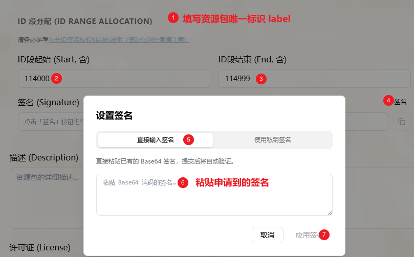
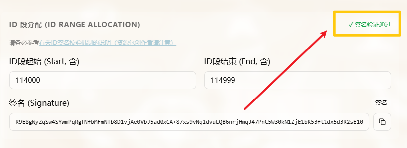

# 有关ID签名校验机制的说明（资源包创作者请注意）

## 为什么要添加ID签名校验机制？

MetaMystia为保证资源包之间不发生冲突，设计了基于白名单的签名校验机制。其目的是在保持高度自由的前提下，确保每个资源包中所使用的食材ID、酒水ID、Item ID、稀客ID或其他资源的ID的全局唯一性。

**MetaMystia不会限制任何资源包创作者的合理申请，但提供签名也并不代表对任何非法资源包的认可、支持或推荐。**

## ID段划分

ID可用范围划分为三段：

- `-2147483648<=?<=8999`：游戏保留区
- `9000<=?<=1073741823`：受管理区，需要向MetaMystia申请后方可使用
- `1073741824<=?<=2147483647`：自由区，无需申请即可使用

## 如何申请签名？

通过[QQ群（1034953242）](https://qm.qq.com/q/s0Qp3QPtOC)、[邮箱（`MetaMiku@hotmail.com`）](mailto:MetaMiku@hotmail.com)或[MetaMystia的仓库issue](https://github.com/MetaMikuAI/MetaMystia/issues)，提交您所创作资源包的label（如ResourceExample）以及待申请的ID段（如23000~23999）即可获取签名。MetaMystia将保证该ID段不再分配给其他资源包，从而避免资源包之间的ID冲突。申请完成后，**除非扩展ID段或修改资源包label**，否则无需重复申请签名。

原则上每个资源包可分配的ID段是

$$
[1000n, 1000n+999], n\in\mathbb{Z}
$$

共计**1000个ID**。对于需要更多ID的资源包，请创作者简要注明原因并申请更大的**连续的**ID段。

## 如何使用申请到的签名？

在填写好资源包唯一标识符（label）和申请到的ID段后，资源包创作者只需点击“签名”按钮，粘贴申请到的签名字符串并应用签名即可完成签名的添加操作。在线编辑器会自动对其进行校验，确保资源包的签名有效。

## 暂时没有签名或者不想申请签名怎么办？

资源包创作者可修改`Touhou Mystia Izakaya/BepInEx/config/MetaMystia.cfg`中的`SignatureCheck`项从而禁用签名校验，以便在获得签名前进行临时开发与调试。

如您关闭了签名校验却仍然被提示校验失败，可能是因为资源包中部分ID不在**声明的**ID段内。

如您对白名单签名机制不满意，也可使用自由区ID段。使用该区段ID的资源包不会被执行签名校验，但需自行承担ID冲突的风险。

## 已分配或不可使用的ID段列表

全部已分配或不可用的ID段已经明确列出在下表中，资源包创作者在申请签名时请务必参考该表以避免申请到已分配或不可使用的ID段。

- MetaMystia-ResourceEx ID分配表：[
https://docs.qq.com/sheet/DV2NvRFVKYmJBWGVK](https://docs.qq.com/sheet/DV2NvRFVKYmJBWGVK)
