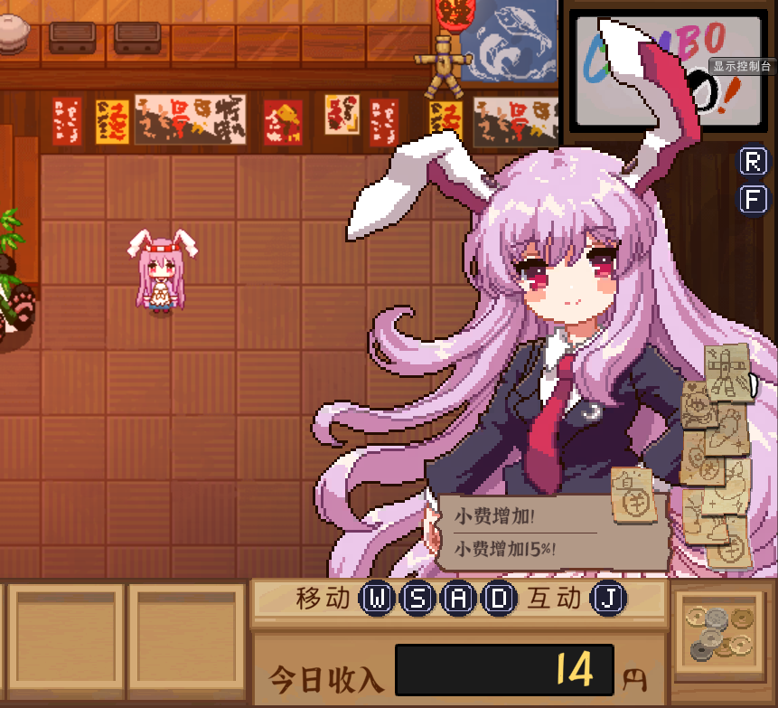
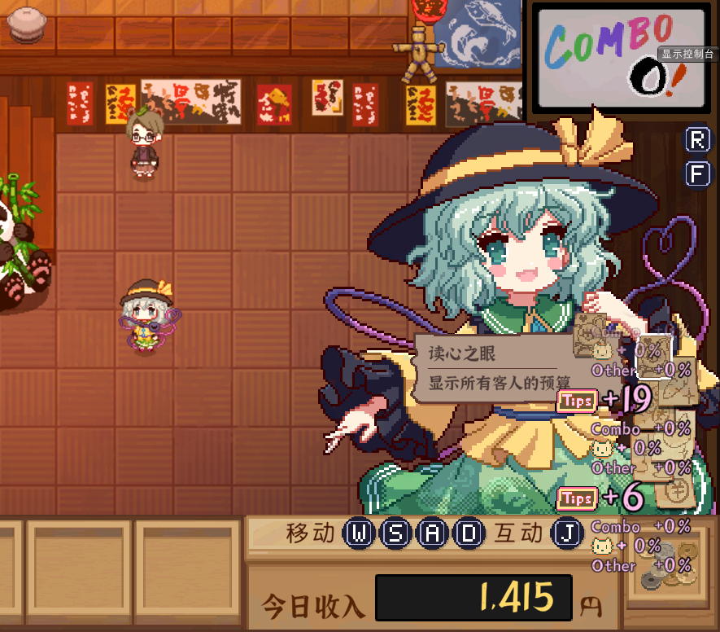

# 皮肤系统

皮肤系统允许用户自定义角色外观，允许玩家使用游戏内全部可用角色皮肤（包括ResourceEx扩展稀客和扩展服装），并且兼容联机系统，玩家在联机中可以看到其他玩家的皮肤。

- `/skin list`列出全部可用皮肤
- `/skin set <id> <Default|Explicit|DLC> <index>`用以切换为指定的皮肤
- `/skin off`关闭皮肤系统并恢复游戏默认服装

示例：

```
/skin set 21 Explicit 0
```



如果您拥有 `DLC2`，可以使用

```
/skin set 2006 Default 0
```



皮肤系统尚在测试阶段，后续一段时间会逐步完善，敬请期待。
